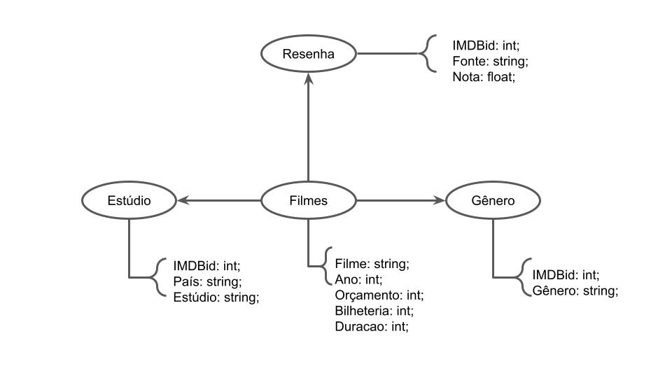

# Aluno
* `216111`: `Gabriel Bonfim Silva de Moraes`

## Laboratório 7 - Modelo Lógico Grafo

## Modelo Lógico

## Perguntas

- Quais os filmes de melhor crítica e maior bilheteria nominal?
- Qual a evolução tel da relação entre os gêneros do filme & bilheteria / crítica?
- Qual a evolução temporal da bilheteria nominal média dos filmes?

