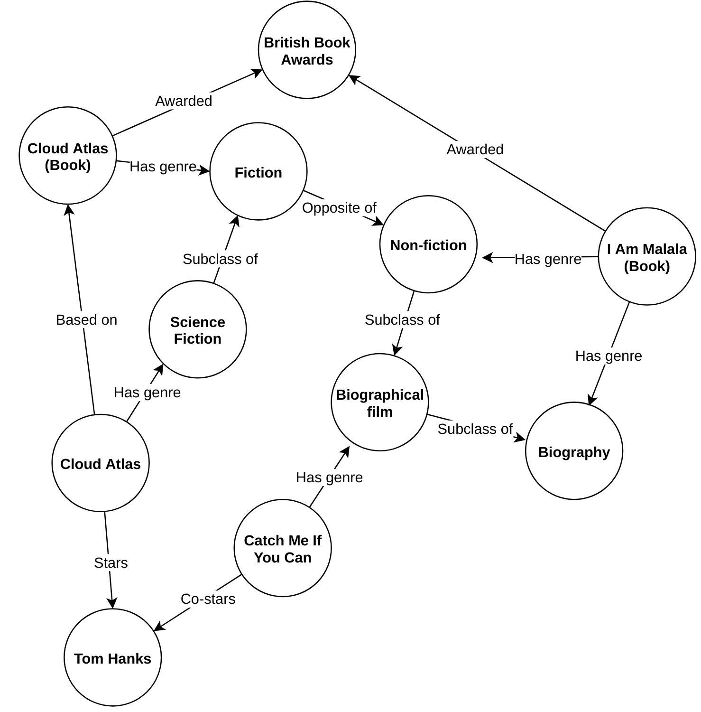

# Aluno
* `216111`: `Gabriel Bonfim Silva de Moraes`

## Grafo de Conhecimento
> No Projeto Final, o grupo não decidiu utilizar o modelo de grafos, contudo, é fácil observar a possível sinergia do modelo com o assunto. Através de uma pesquisa extensa à procura de grafos sobre filmes/escritores/obras, encontramos um trabalho interessante que adicionaria muitos conceitos para o nosso projeto.
> 
> Segue o link com o grafo de uso público: ' https://towardsdatascience.com/movie-recommendations-powered-by-knowledge-graphs-and-neo4j-33603a212ad0
> 
> Esse grafo possui algumas informações que o nosso dataset não possui, isto é, o conhecimento de quais roteiros são baseados em livros ou não, além de relacionamentos diretos entre gêneros, filmes, atores e diretores.
> 
> O objetivo do grafo em si é fazer recomendações conforme a escolha. Basta pesquisar o ator que vocês gosta ou o filme, o grafo retornará parte das conexões que podem se relacionar ao filme pesquisado, assim encontrando ligações com o filme que você gosta.
> 
> 
>

## Possíveis Perguntas

> Liste aqui as três perguntas de pesquisa ou queries
> * Qual a relação entre roteiros adaptados e originais com relação a bilheteria?
> * Atores e diretores tendem a trabalhar juntos?
> * (Relacionando com a nossa database) Existem atores ou diretores que possuem filmes com maior bilheteria?
